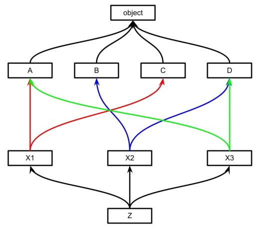

# Урок 10. ООП. Начало

## Classwork

### Теория:

Термины лекции
● Объектно-ориентированное программирование (сокр. ООП) — методология
программирования, основанная на представлении программы в виде
совокупности взаимодействующих объектов, каждый из которых является
экземпляром определённого класса, а классы образуют иерархию
наследования.
● Инкапсуляция — свойство системы, позволяющее объединить данные и
методы, работающие с ними, в классе.
● Наследование — свойство системы, позволяющее описать новый класс на
основе уже существующего с частично или полностью заимствованной
функциональностью. Класс, от которого производится наследование,
называется базовым, родительским или суперклассом. Новый класс —
потомком, наследником, дочерним или производным классом.
● Полиморфизм — свойство системы, позволяющее использовать объекты с
одинаковым интерфейсом без информации о типе и внутренней структуре
объекта.
● Класс — универсальный, комплексный тип данных, состоящий из
тематически единого набора «полей» (переменных более элементарных
типов) и «методов» (функций для работы с этими полями), то есть он является
моделью информационной сущности с внутренним и внешним интерфейсами
для оперирования своим содержимым (значениями полей).

### Инкапсуляция

#### Модификаторы доступа

public
публичный доступ, т.е. возможность обратиться
к свойству или методу из любого другого класса
и экземпляра
protected
защищённый доступ, позволяющий обращаться
к свойствам и методам из класса и из классов
наследников
private
приватный доступ, т.е. отсутсвие возмодности
обратиться к свойству или методы из другого
класса или экземпляра

Символ подчёрквиния определяет уровень инкапсуляции
● self._name
защищённый атрибут (свойство, поле)
● def _method(self):
защищённый метод
● self.__name
приватный атрибут (свойство, поле)
● def __method(self):
приватный метод

### Наследование

Все классы Python наследуются от родительского класса
● пишем так
class Person:
pass
● подразумеваем это
class Person(object):
pass

#### Переопределение методов

Одноимённые методы дочернего класса переопределяют методы родителя

#### Множественное наследование

Любой класс может иметь несколько родительских классов
class Child(Parent1, Parent2, Parent3):
...

MRO
MRO — method resolution order переводится
как «порядок разрешения методов»
● ClassName.mro()

### Полиморфизм
Полиморфизм — свойство системы, позволяющее использовать
объекты с одинаковым интерфейсом без информации о типе и
внутренней структуре объекта.
>>> 42 + 73
115
>>> ‘42’ + ‘73’
'4273'

### task001

- Класс

### task002

- Инкапсуляция

### task003

- Наследование

### task004

- Полиморфизм

## Домашнее задание
Возьмите 1-3 задачи из прошлых занятий и попробуйте перенести переменные и
функции в класс. Убедитесь, что созданный вами класс позволяет верно решать
поставленные задачи.
