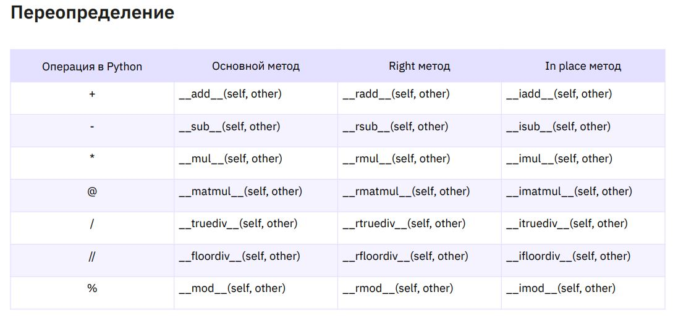
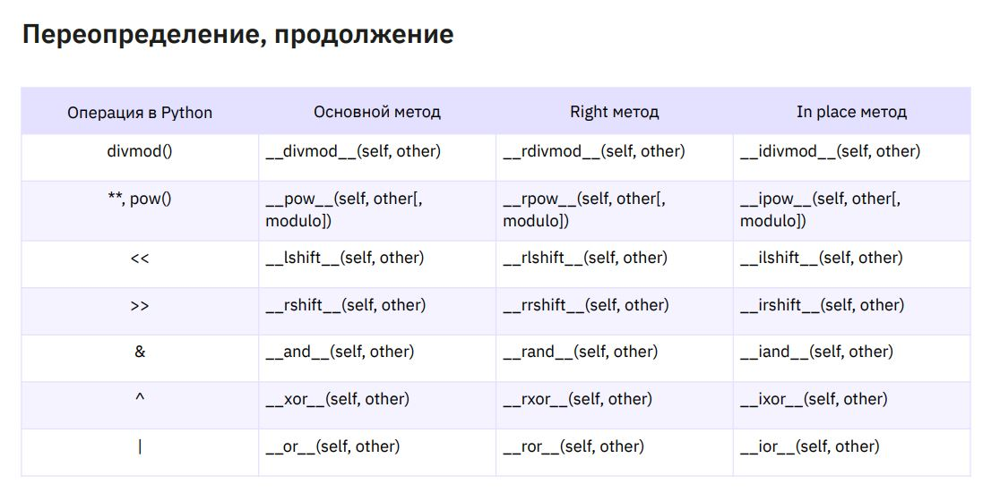
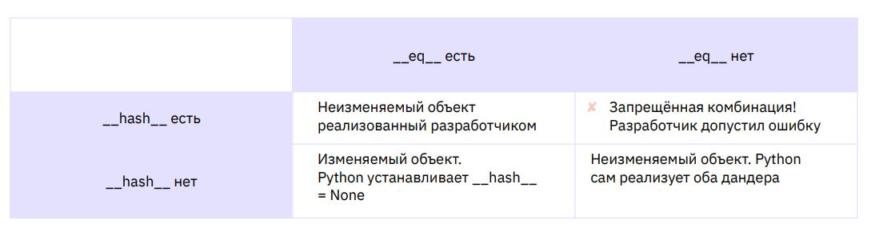

# Урок 11. ООП. Особенности Python

## Теория:

Термины лекции
● Дандер — имя переменной, начинающейся и заканчивающейся двумя
подчеркиваниями. В Python такие переменные используются для создания
специальных свойств и методов объекта, влияющих на его поведение.

### Математика и логика

#### Основные методы

Левый объект вызывает свой метод и возвращает
новый экземпляр класса

class Name:
...
def __add__(self, other):
...
return Name(param)
c = a + b

#### Right методы

Левый объект не находит нужный метод, поэтому правый объект
вызывает свой метод и возвращает новый экземпляр класса
class Name:
...
def __radd__(self, other):
...
return Name(param)
c = b + a

#### In place методы

Объект вызывает свой метод и изменяет своё значение
class Name:
...
def __iadd__(self, other):
...
return self
a += b

### Сравнение экземпляров класса

Python поддерживает определение шести основных операций
сравнения экземпляров
● __eq__ - равно, ==
● __ne__ - не равно, !=
● __gt__ - больше, >
● __ge__ - не больше, меньше или равно, <=
● __lt__ - меньше, <
● __le__ - не меньше, больше или равно, >=

#### Неизменяемые экземпляры, хеширование, дандер __hash__

#### Обработка атрибутов

Получение значения атрибута, __getattribute__

Дандер __getattribute__ вызывается при любой попытке
обращения к атрибутам экземпляра
class Name:
...
def __getattribute__(self, item):
...
return object.__getattribute__(self, item)

#### Присвоение атрибуту значения, __setattr__

Дандер __setattr__ срабатывает каждый раз,
когда в коде есть операция присвоения
class Name:
...
def __setattr__(self, key, value):
...
return object.__setattr__(self, key, value)

#### Обращение к несуществующему атрибуту, __getattr__

Если свойство отсутствует, в первую очередь вызывается дандер
__getattribute__. В случае возврата им ошибки AttributeError
вызывается метод __getattr__
class Name:
...
def __getattr__(self, item):
...
return ...

#### Удаление атрибута, __delattr__

Дандер __delattr__ вызывается при попытке удалить
атрибут командой del
class Name:
...
def __delattr__(self, item):
...
object.__delattr__(self, item)

#### Функции setattr(), getattr() и delattr()

setattr(object, name, value)
аналог object.name = value
getattr(object, name[, default])
аналог object.name or default
delattr(object, name)
аналог del object.name

## Classwork

### task001:

- Создание и удаление
- Дандер
- Шаблон Одиночка, Singleton

### task002:

- Строка документации

### task003:

- Представления экземпляра

### task004:

- Математика и логика

### task005:

- Сравнение экземпляров класса

## Homework

### task001:
Задание
Возьмите 1-3 задачи из прошлых занятий 
и попробуйте перенести переменные и функции 
в класс. Добавьте к ним дандер методы из лекции 
для решения изначальной задачи..
