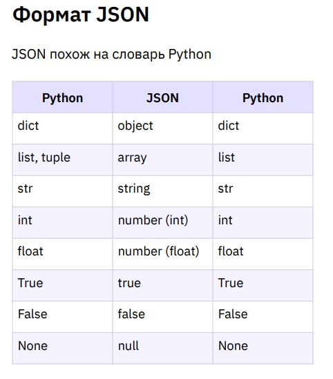

# Урок 8. Сериализация

## Classwork

### Теория

#### Термины лекции

● Сериализация — это процесс преобразования объекта в поток байтов для
сохранения или передачи в память, базу данных или файл.
● Десериализация — восстановление объектов из байт, сохранение которых
было произведено ранее. Процедура выгрузки «зафиксированной»
информации пользователем.

#### Сериализация данных

Десериализация – восстановление объектов
из байт, сохранение которых было произведено
ранее. Процедура выгрузки «зафиксированной»
информации пользователем.
Сериализация — это процесс преобразования
объекта в поток байтов для сохранения или
передачи в память, базу данных или файл.

#### 1. Формат JSON

JSON похож на словарь Python

#### Преобразование JSON в Python

import json
● json_file = json.load(f)
загрузка JSON из файла и сохранение в dict или list
● json_list = json.loads(json_text)
загрузка JSON из строки и сохранение в dict или list

#### Преобразование Python в JSON

import json
● json.dump(my_dict, f)
сохранение dict или list в файле в виде JSON
● dict_to_json_text = json.dumps(my_dict)
сохранение dict или list в виде JSON строки

#### Дополнительные параметры dump и dumps

res = json.dumps(my_dict, indent=2,
separators=(',', ':'),
sort_keys=True)
● Параметр indent отвечает за форматирование с отступами
● Параметр separators принимает на вход кортеж из двух строковых элементов.
Первый — символ разделитель элементов.
Второй — разделитель ключа и значения.
● Параметр sort_keys отвечает за сортировку ключей по алфавиту

#### 2. Формат CSV

CSV — текстовый формат, предназначенный для представления
табличных данных. Строка таблицы соответствует строке текста,
которая содержит одно или несколько полей, разделенных запятыми.
"Name","Sex","Age","Height (in)","Weight (lbs)"
"Alex","M",41,74,170
"Bert","M",42,68,166
"Carl","M",32,70,155

##### Чтение CSV

import csv
● with open('biostats.csv', 'r', newline='') as f:
параметр newline='' для работы с CSV
● csv_file = csv.reader(f)
csv_file позволяет построчно читать csv файл в список list

##### Запись CSV

import csv
● csv_write = csv.writer(f)
csv_write позволяет сохранять данные в формате CSV
● csv_write.writerow(line)
сохранение списка в одной строке файла в формате CSV
● csv_write.writerows(all_data)
сохранение матрицы в нескольких строках файла в формате CSV

#### Запись CSV из словаря

import csv
● Параметры класса DictWriter аналогичны параметрам DictReader
● csv_write.writeheader()
сохранение первой строки с заголовками в порядке их
перечисления в параметре fieldnames
● csv_write.writerow(line)
сохранение списка в одной строке файла в формате CSV
● csv_write.writerows(all_data)
сохранение матрицы в нескольких строках файла в формате CSV

#### 3.Модуль Pickle

Модуль pickle не занимается проверкой потока байт на безопасность
перед распаковкой. Не используйте его с тем набором байт,
безопасность которого не можете гарантировать.
import pickle
res = pickle.loads(b"cos\nsystem\n(S'echo Hello world!'\ntR.")
print(res)

##### Допустимые типы данных для преобразования

● None, True и False;
● int, float, complex;
● str, bytes, bytearrays;
● tuple, list, set, dict если они содержат объекты, обрабатываемые pickle;
● встроенные функции и функции созданные разработчиком и доступные
из верхнего уровня модуля, кроме lambda функций;
● классы доступные из верхнего уровня модуля;
● экземпляры классов, если pickle смог обработать их дандер __dict__
или результат вызова метода __getstate__().

##### Сериализация

import pickle
● pickle.dump(my_dict, f)
сохранение объекта в бинарном файле
● result = pickle.dumps(my_dict)
сохранение объекта в строку байт

##### Десериализация

● new_dict = pickle.load(f)
загрузка из бинарного файла и сохранение в объекта
● new_dict = pickle.loads(data)
получение объекта из бинарной строки

### task001:

- Формат JSON

### task002:

- Формат CSV

### task003:

- Модуль Pickle